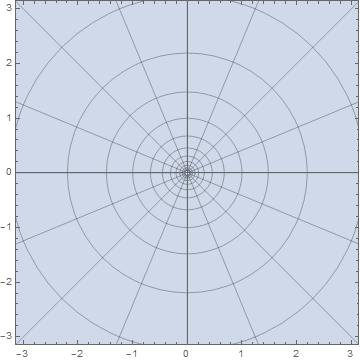
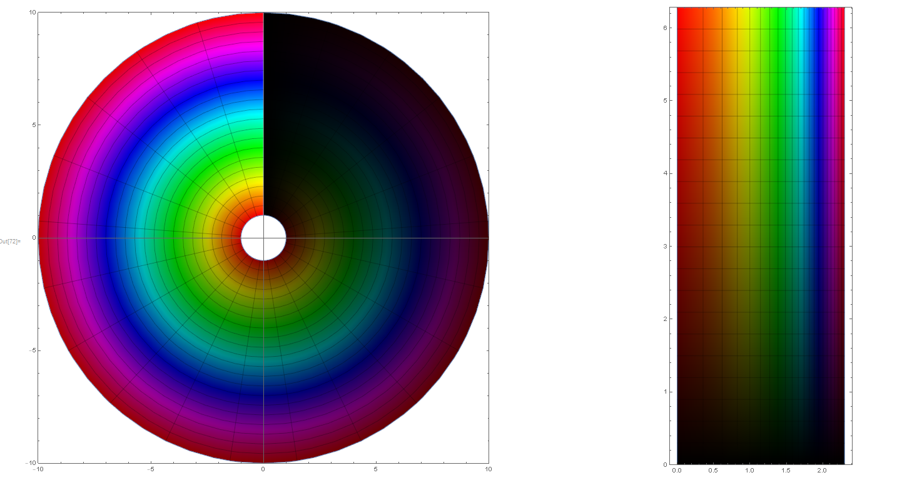

# Computational-Physcis-Notes








## Purpose of the Repository

This repository contains various computational physics scripts and notebooks. The purpose is to provide examples and notes on different computational physics problems and methods.

## Main Files and Their Purposes

- `Python/calculate_trajectory.py`: Calculates the trajectory of a projectile.
- `Python/Cooper_Pairing(BCS Theory).py`: Implements the BCS theory for Cooper pairing.
- `Python/Logic/logic.ipynb`: Contains logic gates and quantum logic examples.
- `Python/lanczos_tridiagonalisation.ipynb`: Demonstrates the Lanczos tridiagonalization method.
- `Python/boundary-value-problem-in-electrostatics_ConformalMap.py`: Solves a boundary value problem in electrostatics using conformal mapping.
- `Python/casimir_force.py`: Calculates the Casimir force between two plates.
- `Python/components-in-series-or-parallel.py`: Calculates equivalent capacitance, resistance, inductance, and spring constants for components in series or parallel.
- `Python/derivative.ipynb`: Demonstrates numerical differentiation methods.
- `Python/discretised_fourier_transform.ipynb`: Demonstrates the discretized Fourier transform.
- `Python/dispersion relation_for_diatomic_chain.py`: Calculates the dispersion relation for a diatomic chain.
- `Python/double_pendulum_LagrangianMechanics.py`: Simulates the double pendulum using Lagrangian mechanics.
- `Python/double_pendulum.py`: Simulates the double pendulum.
- `Python/eigenvalue_problem.ipynb`: Solves eigenvalue problems.
- `Python/finding_roots.ipynb`: Demonstrates numerical root-finding methods.
- `Python/ground_state_quantum_harmonic_oscillator.ipynb`: Solves the ground state of a quantum harmonic oscillator.
- `Python/Hamilton-Jacobi.md`: Notes on the Hamilton-Jacobi equation.
- `Python/Impedances.py`: Calculates impedances in series and parallel circuits.
- `Python/kernel_density_function.ipynb`: Demonstrates kernel density estimation.
- `Python/kirchhoff's-laws.py`: Solves circuits using Kirchhoff's laws.
- `Python/lattice-QCD.py`: Simulates lattice QCD.
- `Python/Logic/logic.ipynb`: Contains logic gates and quantum logic examples.
- `Python/modelling_lithium.ipynb`: Models lithium atoms.
- `Python/numeric_integration.ipynb`: Demonstrates numerical integration methods.
- `Python/Numpy/basic.ipynb`: Basic examples of using NumPy.
- `Python/parton_distribution.py`: Models parton distribution functions.
- `Python/phonon_dispersion.py`: Calculates the phonon dispersion relation.
- `Python/qBits.ipynb`: Demonstrates quantum bits (qubits).
- `Python/runge_kutta_method.ipynb`: Demonstrates the Runge-Kutta method for solving ODEs.
- `Python/Scipy/basic.ipynb`: Basic examples of using SciPy.
- `Python/semiconductor-band-structure.py`: Models the band structure of a semiconductor.
- `Python/simple-harmonic-oscillator_Hamilton-Jacobi_Symbolically.py`: Solves the simple harmonic oscillator using the Hamilton-Jacobi equation symbolically.
- `Python/simple-harmonic-oscillator_Hamilton-Jacobi.py`: Solves the simple harmonic oscillator using the Hamilton-Jacobi equation.
- `Python/simple-harmonic-oscillator_Path Integral_Numerical.py`: Solves the simple harmonic oscillator using the path integral method numerically.
- `Python/simple-harmonic-oscillator_Path Integral_Symbolically.py`: Solves the simple harmonic oscillator using the path integral method symbolically.
- `Python/simple-pendulum_elliptic-integral-of-the-first-kind.py`: Solves the simple pendulum using the elliptic integral of the first kind.
- `Python/simple-pendulum_Hamiltonian-Mechanics.py`: Solves the simple pendulum using Hamiltonian mechanics.
- `Python/stress-strain_curve.py`: Plots the stress-strain curve for elastic and nonelastic materials.
- `Python/symplectic-form.md`: Notes on the symplectic form.
- `Python/three_body_equations.py`: Solves the three-body problem.
- `Python/truncated normal distribution.ipynb`: Demonstrates the truncated normal distribution.
- `Python/two-body-problem.py`: Solves the two-body problem.
- `Python/Type I and Type II-superconductors.py`: Notes on Type I and Type II superconductors.
- `Python/wave_packet_spreading.ipynb`: Demonstrates wave packet spreading.
- `Python/wave_packet_spreading.py`: Demonstrates wave packet spreading.
- `Python/workspace.code-workspace`: VS Code workspace configuration.

## How to Run the Code

1. Clone the repository:
   ```
   git clone https://github.com/ewdlop/Computational-Physcis-Notes.git
   cd Computational-Physcis-Notes
   ```

2. Install the required dependencies. For Python scripts, you can use `pip` to install the necessary packages. For example:
   ```
   pip install numpy matplotlib scipy sympy
   ```

3. Navigate to the desired script or notebook and run it. For example, to run a Python script:
   ```
   python Python/calculate_trajectory.py
   ```

4. For Jupyter notebooks, you can use Jupyter Lab or Jupyter Notebook to open and run the notebooks. For example:
   ```
   jupyter lab Python/Logic/logic.ipynb
   ```

5. Follow the instructions and comments within each script or notebook for specific usage details.
